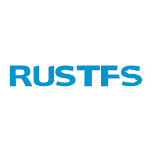

# RustFS S3 Object Storage — Jelastic/Virtuozzo JPS Template

One-click **S3-compatible object storage** (RustFS · Rust · Apache-2.0) for the Jelastic/Virtuozzo Application Platform — with built-in HTTPS/domain mapping and a safe long-term version-management workflow.

**[English](#english) · [ภาษาไทย](#ภาษาไทย)**

> ⚠️ **Status: BETA / not yet validated on a live platform.** RustFS is pre-1.0 beta. Every file marked `[VERIFY]` must be tested via **Import > JPS** on a real Jelastic/Virtuozzo environment before a marketplace release. Do not treat as production-ready until the CI gate passes on the target edition.
>
> ⚠️ **สถานะ: BETA / ยังไม่ได้ทดสอบบนแพลตฟอร์มจริง** — RustFS ยังเป็น pre-1.0 beta ทุกไฟล์ที่มี `[VERIFY]` ต้องทดสอบผ่าน **Import > JPS** บน Jelastic/Virtuozzo จริงก่อนปล่อยขึ้น marketplace

---

## English

### One-click deploy

Click the **Deploy to Ruk-Com** button above, or:

**Or import manually:**

1. Open your Ruk-Com / Jelastic dashboard → **Import** → **JPS**
2. Use this URL:
   `https://raw.githubusercontent.com/Ruk-Com-Cloud/rustfs-jps-template/main/manifest.jps`
3. Click **Import** and follow the install wizard

### About

This is the **RustFS** repo. **SeaweedFS** ships as a *separate sibling repo* sharing this exact pattern (production-recommended engine). There is **no runtime engine selector** — the engine is fixed per repo by design.

### Install options (wizard)

| Option | Choices |
|---|---|
| **Topology** | `single` (default, production-safe) · `cluster` (EXPERIMENTAL — RustFS distributed is beta-unstable; ≥4 nodes; warning shown) |
| **Public IP** | attach (default, recommended — required for custom-domain HTTPS) · none |
| **Your S3 domain** | optional; drives the two-phase SSL flow |

### Two-phase domain + HTTPS

1. **Install (Phase 1):** S3 comes up on temporary HTTP; the success page shows the assigned public IP and exact DNS A-record steps.
2. **After DNS propagates (Phase 2):** click **Bind SSL / Issue Certificate** — DNS is validated, a cert is issued/bound on the LB, the endpoint flips to `https://<your-domain>`. Idempotent; re-run for domain change / renewal.

S3 is **path-style only** — configure clients with force-path-style.

### Version management / upgrade

Upgrades are user-driven via the **Change Version** add-on button:

1. Pick a **tested** version (only tags in `configs/vers.yaml` allowlist; never `latest`).
2. Confirm — a **backup is taken first** automatically.
3. Container is redeployed to the new tag **with volume data preserved** (`useExistingVolumes`).
4. Post-upgrade health + S3 smoke run automatically.

**Rollback:** run **Change Version** again, select the **previous** version. If the on-disk format regressed, restore the pre-upgrade backup. RustFS is beta — treat every upgrade as potentially breaking; always test on a non-prod env first.

### Repo layout

| Path | Purpose |
|---|---|
| `manifest.jps` | Main `type:install` — wizard, `bl` LB + `cp` RustFS nodes, onInstall |
| `configs/vers.yaml` | Single source of version truth + tested-tag allowlist |
| `scripts/beforeInit.js` | Dynamic fields, image pin, cluster guard |
| `nginx/s3-proxy.conf.tpl` | SigV4-safe LB reverse-proxy contract |
| `addons/bind-ssl.jps` | Phase-2 "Bind SSL / Issue Certificate" button |
| `addons/change-version.jps` | "Change Version" upgrade button (backup→redeploy→verify) |
| `text/*.md` | Success / SSL / upgrade pages shown to the user |
| `tests/s3-smoke.sh` | Mandatory E2E (SigV4 / multipart / presigned) |
| `.github/workflows/ci.yml` | Install → test → teardown gate |

### Security defaults

Forced generated credentials (no default `rustfsadmin` reaching prod), console not publicly exposed, TLS terminated at the LB, RustFS **CVE-2026-40937** mitigation.

### Release process (ruk-com Ops)

`main` = dev. To ship a new RustFS version: run CI against the candidate tag → on pass, add the tag to `configs/vers.yaml` allowlist + the `change-version.jps` picker → cut Git tag `vX.Y.Z` → point the marketplace/deploy link at that tag. Existing environments do **not** auto-upgrade.

### Verification status

**Resolved against authoritative docs/source** (docs.cloudscripting.com, real
jelastic-jps manifests, rustfs/rustfs@main): LB `nodeType: nginx-dockerized`;
conf.d path + `sudo /etc/init.d/nginx reload`; `showIf` nesting on the
controlling field; per-node `environment.binder.AttachExtIp`;
`environment.control.RedeployContainersByGroup` (`tag` + `useExistingVolumes`);
RustFS validates SigV4 against the incoming Host (path-style + Host-preserve →
correct, `RUSTFS_SERVER_DOMAINS` unset); health `/health` (200) & strict
`/health/ready` (503→200); non-root UID 10001; LE add-on `deployHook` contract
(it does **not** write our :443 vhost — we own it via `scripts/deployHook.js`);
no public API to trigger backup-addon externally → own `/backups` snapshot.

**Remaining `[VERIFY-LIVE]`** (only confirmable by a real install): public-IP
attach IPv4/quota behavior on the target edition · RustFS distributed/cluster
erasure-set formation & stability (beta) · LE cert issuance + our deployHook
firing/reload end-to-end on :443 · conf.d coexistence with the platform
SLB/jem-ssl path · S3 E2E (SigV4/multipart/presigned) green through the LB ·
s3-tests acceptance baseline (OQ-6).

### License

The template (this repo) — see `LICENSE`. RustFS itself is Apache-2.0 (separate upstream project: <https://github.com/rustfs/rustfs>).

---

## ภาษาไทย

### ติดตั้งคลิกเดียว

กดปุ่ม **Deploy to Ruk-Com** ด้านบน หรือ:

**หรือ import เอง:**

1. เปิด dashboard Ruk-Com / Jelastic → **Import** → **JPS**
2. ใช้ URL นี้:
   `https://raw.githubusercontent.com/Ruk-Com-Cloud/rustfs-jps-template/main/manifest.jps`
3. กด **Import** แล้วทำตาม wizard ติดตั้ง

### เกี่ยวกับ template นี้

repo นี้คือเครื่องยนต์ **RustFS** ส่วน **SeaweedFS** อยู่ใน *repo พี่น้องแยกต่างหาก* ที่ใช้ pattern เดียวกัน (เป็น engine ที่แนะนำสำหรับ production) — **ไม่มีตัวเลือกสลับ engine ตอนรัน** เพราะออกแบบให้ engine ตายตัวต่อ repo

### ตัวเลือกตอนติดตั้ง (wizard)

| ตัวเลือก | ค่าที่เลือกได้ |
|---|---|
| **Topology** | `single` (ค่าเริ่มต้น ปลอดภัยสำหรับ production) · `cluster` (ทดลอง — RustFS distributed ยัง beta ไม่เสถียร ต้อง ≥4 nodes มีคำเตือน) |
| **Public IP** | แนบ (ค่าเริ่มต้น แนะนำ — จำเป็นสำหรับ HTTPS บนโดเมนตัวเอง) · ไม่แนบ |
| **โดเมน S3 ของคุณ** | ไม่บังคับ; ใช้ขับ flow SSL สองเฟส |

### ผูกโดเมน + HTTPS สองเฟส

1. **ตอนติดตั้ง (เฟส 1):** S3 ขึ้นบน HTTP ชั่วคราว หน้า success แสดง public IP จริง + ขั้นตอนสร้าง DNS A record
2. **หลัง DNS propagate (เฟส 2):** กดปุ่ม **Bind SSL / Issue Certificate** — ระบบตรวจ DNS, ออก/ผูกใบรับรองที่ LB, สลับ endpoint เป็น `https://<โดเมนคุณ>` (กดซ้ำได้ กรณีเปลี่ยนโดเมน/ต่ออายุ)

S3 ใช้ **path-style เท่านั้น** — ตั้ง client เป็น force-path-style

### การจัดการเวอร์ชัน / อัปเกรด

อัปเกรดผ่านปุ่ม add-on **Change Version**:

1. เลือกเวอร์ชันที่ **ผ่านการทดสอบ** (เฉพาะ tag ใน allowlist `configs/vers.yaml` — ห้าม `latest`)
2. ยืนยัน — ระบบ **สำรองข้อมูลก่อนเสมอ** อัตโนมัติ
3. redeploy container ไป tag ใหม่ **โดยรักษาข้อมูลใน volume** (`useExistingVolumes`)
4. ตรวจ health + รัน S3 smoke หลังอัปเกรดอัตโนมัติ

**Rollback:** กด **Change Version** อีกครั้ง เลือกเวอร์ชัน**ก่อนหน้า** หากรูปแบบ on-disk เปลี่ยน ให้กู้จาก backup ก่อนอัปเกรด — RustFS ยัง beta ถือว่าทุกการอัปเกรดอาจ breaking ทดสอบบน env ทดสอบก่อนเสมอ

### โครงสร้าง repo

| Path | หน้าที่ |
|---|---|
| `manifest.jps` | install หลัก — wizard, LB `bl` + RustFS `cp`, onInstall |
| `configs/vers.yaml` | แหล่งความจริงเรื่องเวอร์ชัน + tested-tag allowlist |
| `scripts/beforeInit.js` | dynamic field, pin image, cluster guard |
| `nginx/s3-proxy.conf.tpl` | สัญญา reverse-proxy ที่ปลอดภัยต่อ SigV4 |
| `addons/bind-ssl.jps` | ปุ่มเฟส 2 "Bind SSL / Issue Certificate" |
| `addons/change-version.jps` | ปุ่ม "Change Version" (backup→redeploy→verify) |
| `text/*.md` | หน้า success / ssl / upgrade ที่ผู้ใช้เห็น |
| `tests/s3-smoke.sh` | E2E บังคับ (SigV4 / multipart / presigned) |
| `.github/workflows/ci.yml` | gate: install → test → teardown |

### ค่า default ด้านความปลอดภัย

บังคับสร้าง credential ใหม่ (ไม่มี `rustfsadmin` default หลุดถึง prod), console ไม่ expose สาธารณะ, TLS terminate ที่ LB, มีมาตรการลด **CVE-2026-40937** ของ RustFS

### กระบวนการออกเวอร์ชัน (ทีม ruk-com)

`main` = dev ออกเวอร์ชันใหม่: รัน CI กับ tag candidate → ผ่านแล้วเพิ่ม tag เข้า allowlist `configs/vers.yaml` + picker ใน `change-version.jps` → cut Git tag `vX.Y.Z` → ชี้ลิงก์ deploy/marketplace ไป tag นั้น — environment เดิมจะไม่อัปเกรดอัตโนมัติ

### สถานะการ verify

**ยืนยันแล้วจากเอกสาร/ซอร์สทางการ** (docs.cloudscripting.com, manifest jelastic-jps จริง, rustfs/rustfs@main): LB `nodeType: nginx-dockerized` · path conf.d + `sudo /etc/init.d/nginx reload` · โครงสร้าง `showIf` บน field ที่คุม · `environment.binder.AttachExtIp` ราย node · `environment.control.RedeployContainersByGroup` (`tag` + `useExistingVolumes`) · RustFS validate SigV4 ด้วย Host ที่เข้ามา (path-style + preserve Host = ถูกต้อง ไม่ต้องตั้ง `RUSTFS_SERVER_DOMAINS`) · health `/health` (200) และ `/health/ready` (503→200) · non-root UID 10001 · contract `deployHook` ของ LE add-on (มันไม่เขียน :443 vhost ให้ — เราเขียนเองผ่าน `scripts/deployHook.js`) · ไม่มี API เรียก backup-addon ข้าม JPS → ใช้ snapshot `/backups` เอง

**เหลือ `[VERIFY-LIVE]`** (ยืนยันได้เฉพาะตอน install จริง): พฤติกรรม attach public IPv4/quota บน edition เป้าหมาย · การฟอร์ม erasure-set ของ RustFS cluster (beta) · การออก cert ของ LE + deployHook ทำงาน/reload :443 ครบ flow · conf.d อยู่ร่วมกับ path SLB/jem-ssl ของแพลตฟอร์ม · E2E S3 (SigV4/multipart/presigned) ผ่าน LB เขียว · baseline s3-tests (OQ-6)

### License

ตัว template (repo นี้) — ดู `LICENSE` ส่วน RustFS เองเป็น Apache-2.0 (โปรเจกต์ต้นน้ำแยก: <https://github.com/rustfs/rustfs>)
